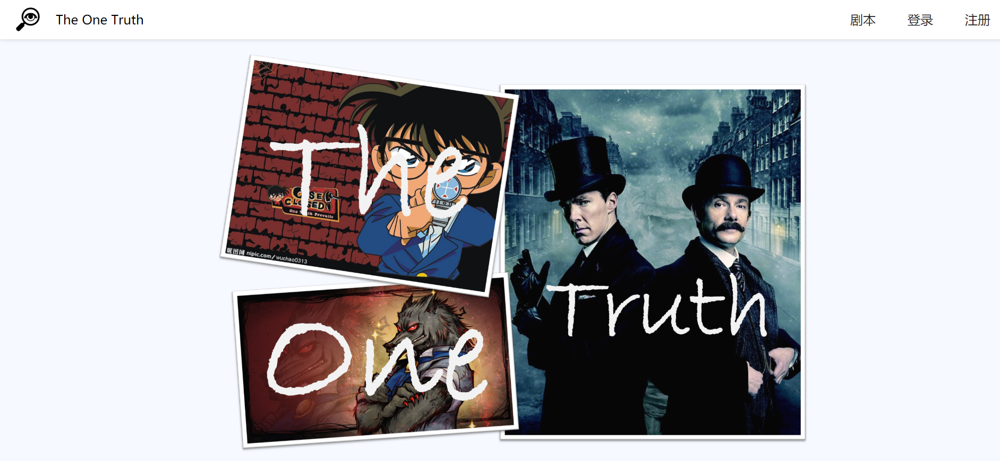
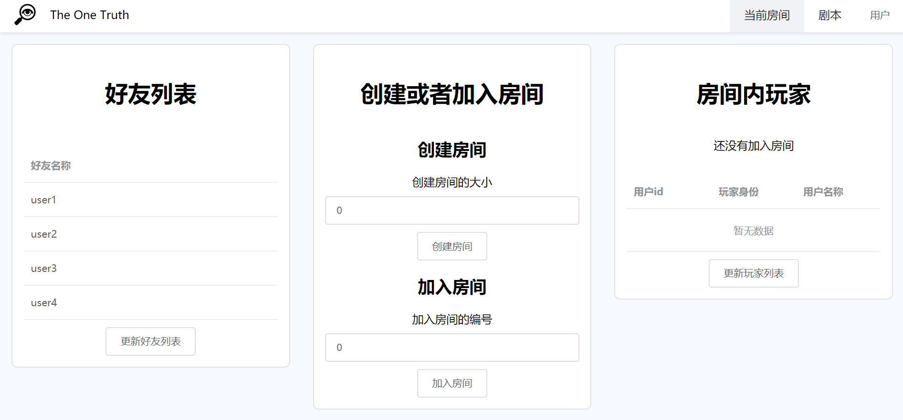

# the-one-truth平台说明

The one truth是一款web应用，开发目的是建立一个集成剧本创作和剧本杀游戏的综合平台，该平台需要具有方便易用、稳定可靠的特点，能够让游戏玩家便利地开展剧本杀游戏，也能够让剧本创作与玩家沟通交流，提升剧本质量。


# 部署说明

## 前端部署说明

**安装与运行**

前端采用vue-cli3脚手架框架进行的部署，因此需要系统中安装了node和npm包管理工具，来安装前端页面所依赖的包括Vue组件以及各种插件。具体的下载需要从[官网](https://nodejs.org/en/)下载对应系统版本并且安装。

```shell
# 查看安装状况
node -v
npm -v
```

切换到前端对应的目录，使用npm包管理工具安装相关依赖。

```shell
cd .\front-end\the-one-truth\
npm install
```

等待安装完成后启动，然后根据提示的浏览器端口进行网页访问。

```shell
npm run serve
```


## 后端部署说明

**运行方式**

0. 环境要求

    ```
    python 3.6.8
    Django 3.0.6
    django-cors-headers 3.3.0
    MySQL 8.0.20
    ```

1. 创建数据库

    * 先在MySQL数据库中手动创建数据库：the_one_truth_database

    * 定义数据库 tables

        ```bash
        cd the_one_truth/back_end
        bash init_migration.sh
        ```

    * 批量导入用户数据：生成 sql 文件

        ```bash
        python generate_data.py user load_data.sql
        ```

2. 启动服务器

    ```bash
    cd the_one_truth
    python manage.py runserver 0.0.0.0:8000
    ```

# 游戏界面使用说明

## 主界面

在此界面可以完成的功能

- 浏览目前平台所有的剧本简介信息
- 登录
- 注册




## 房间界面

在此界面可以完成的功能

- 创建一个指定大小的房间
- 加入一个由他人创建的指定编号的房间
- 创建房间者（房主）可以在显示的剧本列表（这些剧本的参与人数和此房间大小相符合）中选取一个剧本
- 刷新当前房间内玩家（手动或自动）
- 进入游戏




## 游戏界面

此界面可以完成的功能

- 发送和接受消息
- 查看游戏内容，包括背景故事、时间线和人物
- 进行线索的搜证
- 选取凶手
- 查看真相

